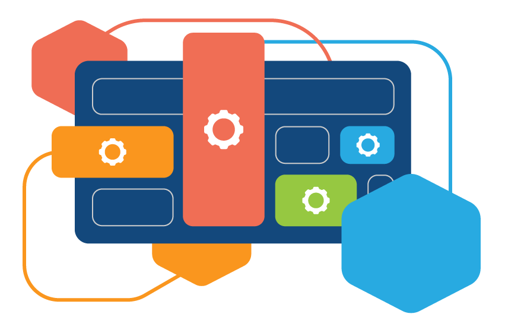
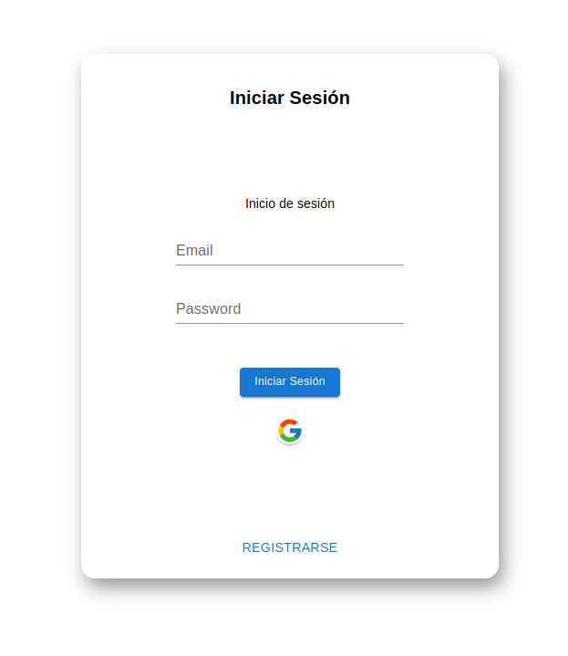
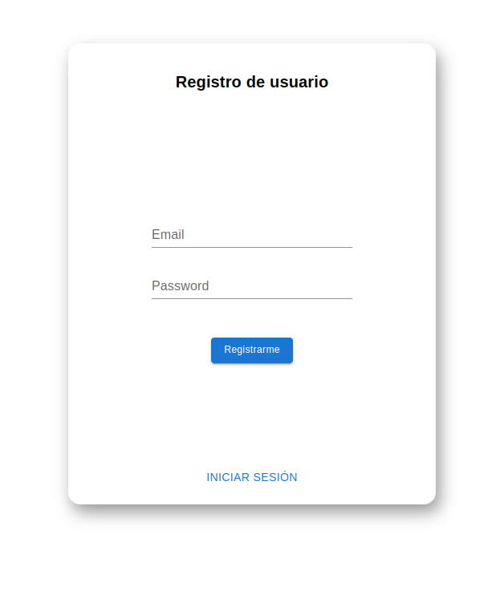
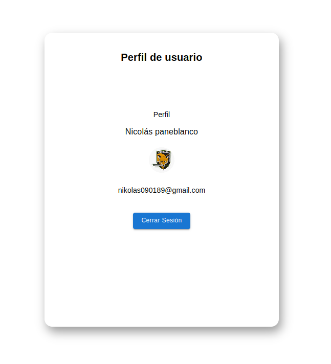

<h1 align="center" >
    Micro Frontend - Login
</h1>

    

 

  <a href="https://github.com/pmNiko/mfe-auth/wiki">Lea más acerca de su implementación</a>

 

---

 

> [!NOTE]
>
> **Objetivo**
>
> - Este MF será el responsable de ññevar a cabo la autentocación del usuario.
> - Con esto en mente crearemos las interfaces UI básicas para llevar adelante esta tarea.
> - Registro
> - Inicio de sesión
> - Perfil

 

> [!TIP]
>
> **Recursos externos**
>
> - La estrategia de implementación esta detallada en el repositorio del App Shell
> - [mfe-shell](https://github.com/pmNiko/mfe-shell)
>
> - De todas maneras es recomendable dirigirse a la documentación oficial de Firebase para
>   realizar la impelemtación de integración del servicio.

 

> [!IMPORTANT]
>
> **Variables de entorno**
>
> - VITE_BASENAME -> para la mayoria de hosting sera un string vacio
> - VITE_FB_API_KEY
> - VITE_FB_MESSAGING_SENDER_ID
> - VITE_FB_APP_ID

 

> [!NOTE]
>
> **Exposición de módulos**
>
> - Se expone el enrutador de la app.
> - También se exponen los componentes de Login y Profile.
> - Por último se comparte el store. Este al ser consumido se recomienda definir la interface
>   para tener inferencia de tipos.
> - En resumidas cuentas de la store será importante lograr consumir:
>   1- El estado de sesión de usuario
>   2- Iniciar sesión  
>   3- cerrar sesión

 

> [!CAUTION]
>
> **Tener en cuenta**
>
> - Las dependencias compartidas deben ser declaradas en el shared de vite.config.js
> - El app shell deberá tener instalada la dependencia de zustand para poder consumir el módulo.

 

 Screenshots

    
    
    

